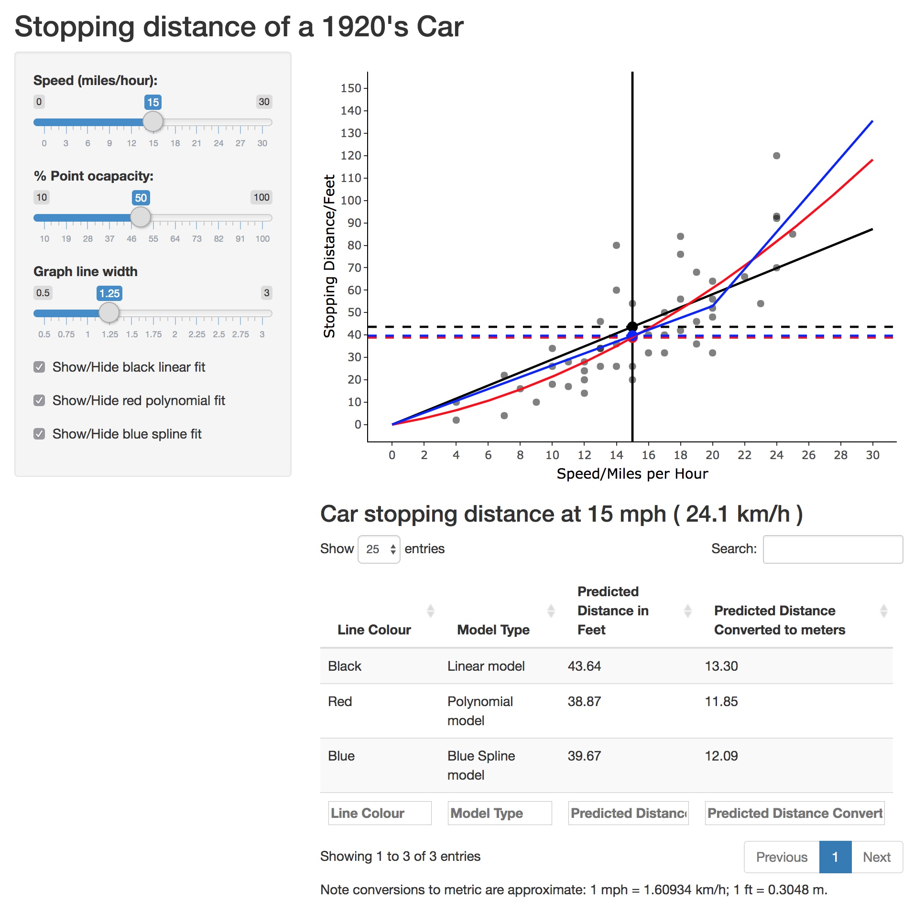

```{r setup, include=FALSE}
library(knitr) 
knitr::opts_chunk$set(message = FALSE, warning = FALSE, error = FALSE)
```

## The Data

The model for the data `cars` was loaded from the datasets package.

```{r libs, echo=FALSE}
library(ggplot2)    # Version 3.0.0
library(plotly)     # Version 4.8.0
library(data.table) # Version 1.11.4
library(datasets)   # Version 3.5.1
```

```{r}
data("cars")
head(cars)
```

* `speed`, Speed in miles per hour (mph)
* `dist`, Stopping distance in feet (ft)

## The Models

Three models were fit to the data:

* A linear model (order 1 polynomial).
* A quadratic model (order 2 polynomial).
* A spline model with a single breakpoint set at 20 mph.

```{r}
fit1 <- lm(dist ~ speed -1, data = cars)
fit2 <- glm(dist ~ speed + I(speed^2) -1, data=cars)
cutspeed <- 20
d1   <- as.data.frame(cbind(cars, speedsp = ifelse(cars$speed > cutspeed, cars$speed - cutspeed, 0 )))
fit4 <- lm(dist ~ speedsp + speed -1, data=d1)
```

## The Calculation of the Result

<div style="width:50%; float:left">
```{r}
### In app xint is the speed inputed by the user
xint <- 27.5 
ndat <- as.data.frame(xint)
colnames(ndat) <- "speed"

ndat <- as.data.frame(cbind(
     xint,
     ifelse(xint > cutspeed, xint - cutspeed, 0 )
     ))
colnames(ndat) <- c("speed","speedsp")

yint1 <- predict(fit1, newdata = ndat)
yint2 <- predict(fit2, newdata = ndat)
yint4 <- predict(fit4, newdata = ndat)
tbl <- data.frame(rbind(c(yint1,yint2,yint4)))
colnames(tbl) <- c("Linear", "Quadratic","Spline")
tbl # List of predictions in feet
```
</div>

<div style="width:45%; float:right; margin: 0 0 0 10px;">
* `xint` is set to `input$xint`, the inputed speed of the user.
* `ndat` is a data fame of 1 or 2 colums depending on the model where all values equal `input$xint`.
* Using `predict()` the values for stopping distance in feet were calculated with `newdata` set equal to the data frame, `ndat`.
* Predictions are stored as `yintx` where x denotes 1, 2 or 4.
     * `yint1` for the linear model.
     * `yint2` for the quadratic model.
     * `yint4` for the spline model.
     
</div>

## The App's UI

<div style="width:50%; float:left">

```{r, echo=FALSE, fig.cap="**Figure 1:** Annotated capture of the app running with default values in a Google Chrome Version 69.0.3497.100 (64-bit)", out.width="80%"}

```

</div>
<div style="width:45%; float:right; margin: 0 0 0 10px;">
* Plot shown to user on top right.
* Lines on plot to highlight to user the input and output values.
* Formatted table shown below plot showing predicted values.
     * Summary table displayed in both imperial and metric units.
* Using `ggplotly()` the plot is build in `ggplot()` then interactivity is added using `plotly()`.
     * Points/lines can be hovered over to see information.
     * Plot can be rescaled/zoomed.
* On left hand side is a number of options for the user:
     * Change input speed.
     * Change visual aspects of the plot.
</div>


