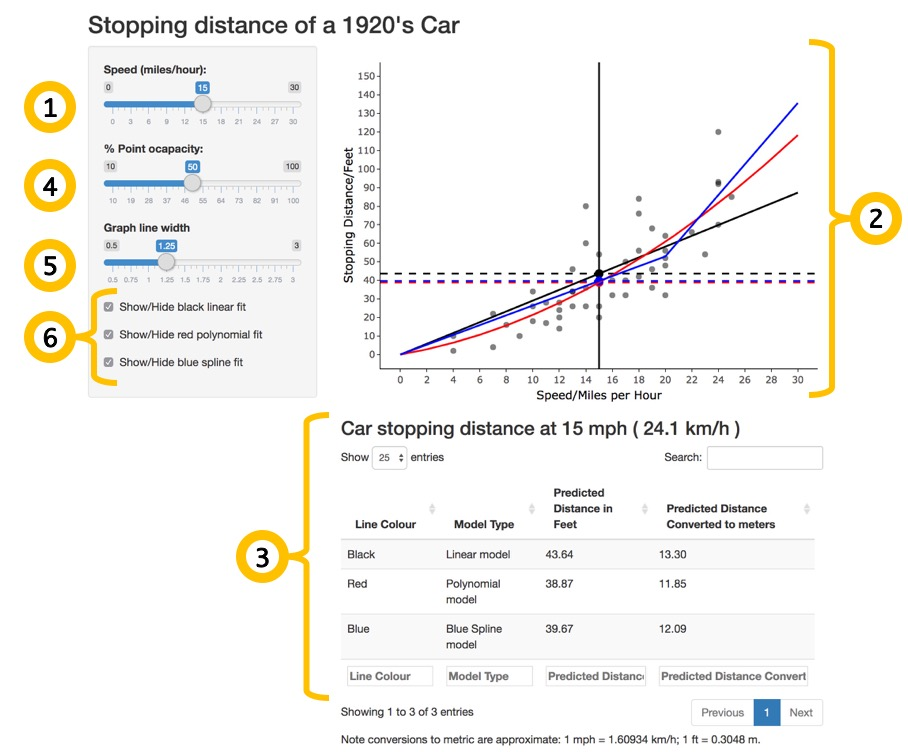

## Introduction

This is a simple shiny app that predicts the stopping distance in feet of a car from the 1920s between 0 and 30 miles per hour (mph). The speed is selected using a slider and three differenr predicted stopping distances are produced. Some visual aspects of the graph can be controlled either by slider or checkbox.

### The Data

The data comes from a data set called `cars` from the `datasets` package in R. It is simply a list of 50 observations of the stopping distance of cars in feet from 1920's at a measured speed in miles per hour.

### The model

The predictions are created in three different ways:

1. By drawing a straight line through the points (linear model).
2. By drawing a curved line through the points (polynominal model).
3. By splitting the data in two between 0 and 20 mph, and between 20 and 30 mph. A line is drawn through each region of the data which meets at 20mph (spline model).

The speed at the choosen set speed is then be predicted by matching where the value on the lines match on the speed and distance axes.

## Getting Started

### 1. Select the Speed of the Car

The speed of the car can be adjusted with a slider named 'Speed' at Figure 1, number 1. The solid black line on the graph will move as you move the slider to show the speed you have choosen on the graph.

### 2. See the Predictions

The models used to predict the stopping distance and the predictions can be seen in the graph area, Figure 1, number 2. The dashed horizontal lines show the value at where the solid black line (the selected speed) intercepts the model.

The results for a set speed can be seen sumarised in a table below the graph expressed in both feet and meters for each line in Figure 1, number 3.

**Note:** Conversions to metric are approximated: 1 mph = 1.60934 km/h; 1 ft = 0.3048 m.

### 3. Change the Appearance of the Graph

The appearance of the graph can be altered in the ways.

#### Opacity of the Data Points

The slider '% Point ocapacity' in Figure 1, number 4 allows you to adjust the opacisity of the points on the graph to either hide them or make them more clear.

#### The Width of the Lines on the Graph

'Graph line width' in Figure 1, nuber 5 adjusts the thickness of the lines on the graph.

#### Selection of Which Models are Shown on the Graph

The three checkboxes in Figure 1, nuber 6 toggle the drawn lines representing the three models. The check boxes are labeled with the lines colour and the model type for ease of use. 

### 4. Application Overview

**Key to Figure 1**

1. Slide to select speed in miles per hour.
2. Graph area with speed in miles per hour on horizontal (x-) axis and stopping distance in feet on the vertical (y-) axis. The points from the original data are shown alongside the lines representing the fitted models. The vertical solid black line represents the selected speed. The dashed horizontal lines show the prediction of each model for the selected speed.
3. Results table showing the predicted stopping distance in feet and meters. **Note:** Conversions to metric are approximated: 1 mph = 1.60934 km/h; 1 ft = 0.3048 m.
4. Slider to adjust opacity of the points from the original data.
5. Slider to adjust width of the lines on the graph.
6. Checkboxes to individually toggle the lines representing the three prediction models.
